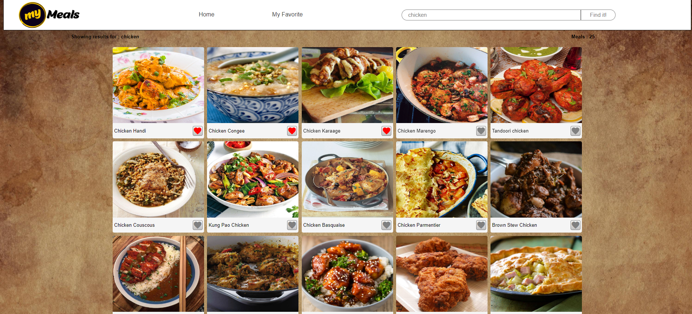
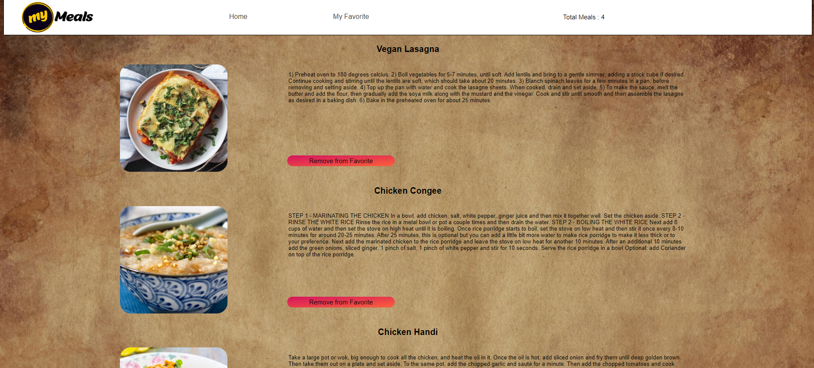
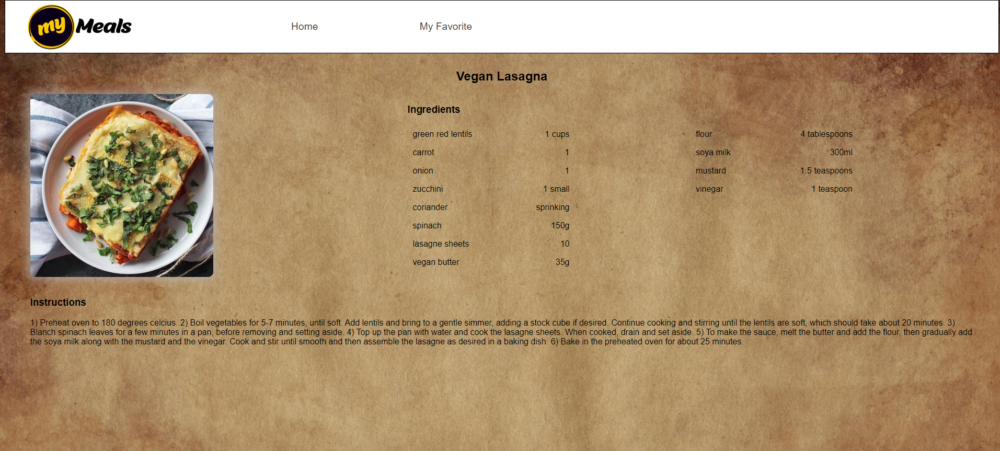

# myMeal App

A simple meal app built using vanilla HTML, CSS and JavaScript to store and search for meals from mealDB API.

Go to hosted page from here [myMeal App](https://rkprajapati01.github.io/myMeal-App/)

## Table of Contents
- [Features](#features)
- [Technologies Used](#technologies-used)
- [Installation](#installation)
- [Usage](#usage)
- [Contributing](#contributing)
- [Screenshot](#screenshot)

## Features

- **Home Page**: Displays the search bar and search results.
- **Search Functionality**: Users can search for meals from an API, and search results update dynamically as they type.
- **Favorite Meals**: Users can add meals to their list of favorite meals.
- **Meal Detail Page**: Provides more information about a selected meal.
- **My Favorite Meals Page**: Displays a list of all favorite meals, with the ability to remove meals from the list.
- **Persistent Storage**: Favorite meals are stored persistently, so they remain even after closing or refreshing the browser.

## Technologies Used

- Frontend: HTML, CSS, JavaScript
- API: [The Meal API](https://www.themealdb.com/api.php)

## Installation

1. Clone the repository:
```bash
 git clone https://github.com/rkprajapati01/myMeal-App
```

## Usage

1. Go to home page.
2. Search anything from the search box then meals will be shown.
3. Clicking on meal image will open the meal Detail page with respect to that meal.
4. You can add as required meal into favorite list by clicking on favorite **Heart** button.
5. Click on My Favorite tab to open your favorite list.
6. To remove meal from favorite list just click on **Remove from favorite** button.

## Contributing

1. Fork the repository.
2. Create a new branch: `git checkout -b feature-name`.
3. Make your changes.
4. Push your branch: `git push origin feature-name`.
5. Create a pull request.

## Screenshot

### Home Page



### My Favorite



### Meal Page


